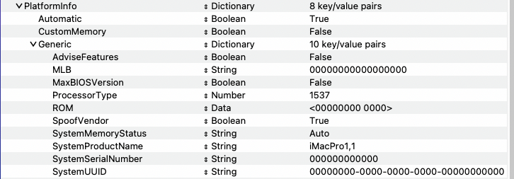

# RYZENTOSH - RYZEN 5 4650G PRO - B550N - RX 6600 XT

:information_source: **Running macOS Sequoia latest version.**
OpenCore, drivers, and kexts are up to date. (9/12/24).

 

## Current Status

## :warning: Disclaimer

This repository contains ONLY my complete EFI configuration based on personal experiments with my specific hardware. This is NOT a guide and should NOT be used as such. Before doing anything, please refer to the official [Dortania guide](https://dortania.github.io/getting-started/). This OpenCore configuration is optimized for my specific hardware. Use it only as a reference or if you have exactly the same or very similar hardware. I am NOT responsible for any damage caused by misuse of this configuration.

## :computer: Hardware:

| **Category** | **Component**                                                                    |
| ------------ | -------------------------------------------------------------------------------- |
| **CPU**      | 3,7 GHz AMD Ryzen 5 4650G PRO 6-Core Processor                                   |
| **GPU**      | ASROCK Phantom Gaming - AMD Radeon RX 6600 XT 8 GB                               |
| **RAM**      | 16GB DDR4 3200MHZ                                                                |
| **CHIPSET**  | B550M MORTAR [MSI](https://www.msi.com/Motherboard/MAG-B550M-MORTAR) |
| **SSD**      | 1TB XRAYDISK                                                                     |
| **Ethernet** | Realtek RTL8125 2.5Gb Ethernet                                                   |
| **Audio**    | Realtek ALCS1220A (layout-id=1)                                                  |

## :white_check_mark: Working:

- [x] CPU power management.
- [x] Graphics acceleration.
- [x] Keyboard & Mouse
- [x] Wi-Fi.
- [x] Bluetooth.
- [x] USB ports.
- [x] HDMI video & audio output.
- [x] Ethernet.
- [x] Audio (Internal speakers, 3.5mm headphone jack).
- [x] Internal microphone.
- [x] VGA WebCam.
- [x] AirDrop & Handoff.
- [x] iCloud & App Store.
- [x] iMessage & FaceTime.

## :x: Not working:

Nothing, All features are working.

## :closed_lock_with_key: SMBIOS

You will need to generate your own SMBIOS and configure, since is required to fully work with macOS. As per this [guide](https://dortania.github.io/OpenCore-Install-Guide/AMD/zen.html#platforminfo) you can use the following SMBIOS: iMacPro1,1 or MacPro7,1. Note that if your hardware is different for the one mentioned [here](#computer-hardware) you have tho choose an appropriate SMBIOS, more details in the [guide](https://dortania.github.io/OpenCore-Install-Guide/AMD/zen.html).

Use [GenSMBIOS](https://github.com/corpnewt/GenSMBIOS) to generate your own unique SMBIOS and then copy each parametter following path (recomended to follow the guide above):

- Config.plist -> PlatformInfo -> Generic

## BIOS setup:

IMPORTANT: Need to **enable** Above 4G Decoding and set Resize BAR to Auto on BIOS or will not work!
If you don't have this on your BIOS you will need to adjust the config.plist, refer to [AMD bios settings](https://dortania.github.io/OpenCore-Install-Guide/AMD/zen.html#amd-bios-settings) and [boot-args](https://dortania.github.io/OpenCore-Install-Guide/AMD/zen.html#nvram)

## Credits:

[**AMD-OSX**](https://github.com/AMD-OSX/AMD_Vanilla)

[**Acidanthera**](https://github.com/acidanthera)

[**Dortania**](https://dortania.github.io/getting-started/)

[**Apple**](http://apple.com/)
